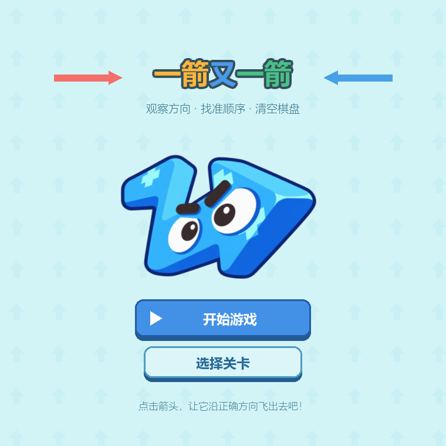
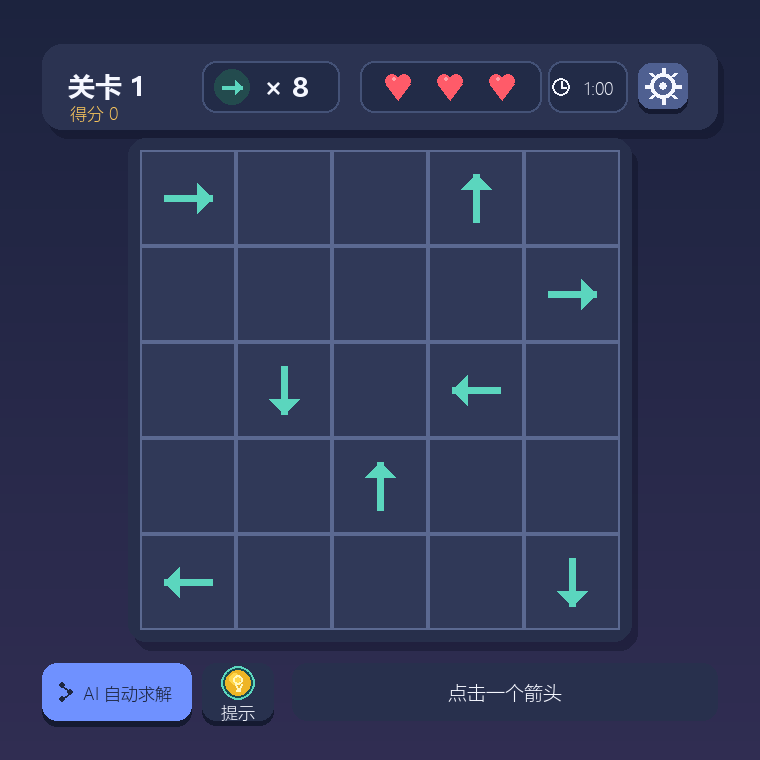
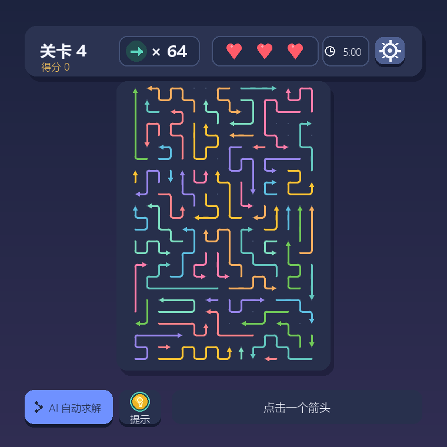

# 一箭又一箭 · ArrowGame

使用 Python 和 Pygame 开发的点箭头益智小游戏。观察箭头的方向，按照合理顺序清空棋盘，在倒计时结束前完成挑战。

## 游戏简介

游戏包含 5 个关卡，分为基础关卡和挑战关卡：

| 关卡 | 类型 | 棋盘规模（行 × 列） | 倒计时 |
| --- | --- | --- | --- |
| 第 1 关 | 基础：单格箭头 | 5 × 5 | 60 秒 |
| 第 2 关 | 基础：单格箭头 | 5 × 5 | 90 秒 |
| 第 3 关 | 基础：单格箭头 | 6 × 6 | 120 秒 |
| 第 4 关 | 挑战：折线箭头 | 24 × 16 个坐标点 | 300 秒 |
| 第 5 关 | 挑战：折线箭头 | 28 × 18 个坐标点 | 420 秒 |

基础关卡检查箭头前进方向上、同一行或同一列是否存在其他箭头；挑战关卡检查箭头头部到边界的直线路径是否被其他折线占据。无阻挡的箭头可以飞出，折线箭头会沿自身轨迹逐渐移出。

每关有 3 次失误机会。清空棋盘后通关并解锁下一关；失误机会耗尽，或倒计时结束时棋盘仍有箭头，则本关失败。

## 开发环境

- 开发与验证平台：Windows。
- 开发语言：Python 3.13（开发时使用 Python 3.13.7）。
- 图形库：Pygame 2.6.x，依赖范围为 `pygame>=2.6,<3`。
- 开发工具：Visual Studio Code、Git。
- 窗口尺寸：760 × 760，目标帧率：60 FPS。

界面使用微软雅黑字体，建议在 Windows 上运行；其他系统可能需要安装中文字体或调整 `main.py` 中的字体设置。

## 安装和运行

### 从源代码运行

安装 Python，在 Windows 安装界面勾选 **Add Python to PATH**。

下载项目：可以在 GitHub 仓库点击 **Code → Download ZIP** 并解压，也可以使用 Git：

```powershell
git clone https://github.com/yolo-yi/ArrowGame.git
cd ArrowGame
```

在包含 `main.py` 的项目目录中安装依赖并启动：

```powershell
python -m pip install -r requirements.txt
python main.py
```

请保留完整项目目录，尤其是 `assets` 图片文件夹。只下载 `main.py` 无法运行游戏。

### 下载 Windows 打包版

可以前往 [Releases 页面](https://github.com/yolo-yi/ArrowGame/releases)，在对应版本的 **Assets** 中下载 Windows 游戏压缩包。

将整个压缩包解压到有写入权限的位置，然后双击 `ArrowGame.exe`。打包版无需安装 Python，请保留 EXE 旁边的依赖和资源文件。GitHub 自动生成的 **Source code** 压缩包是源码，不是打包版。

## 游戏操作说明

| 操作 | 效果 |
| --- | --- |
| 开始游戏 | 从第 1 关开始 |
| 选择关卡 | 选择已解锁的基础关卡或挑战关卡 |
| 鼠标左键点击箭头 | 前方无阻挡则飞出；被阻挡则反馈碰撞并扣除一次生命 |
| 点击折线任意线段 | 选择对应的折线箭头 |
| 提示 | 高亮一支可安全飞出的箭头，持续约 3.5 秒 |
| AI 自动求解 | 自动逐支消除可飞出的箭头，并播放飞行动画 |
| 停止求解 | 停止后续自动操作，当前飞行动画继续完成 |
| 右上角设置按钮 | 打开设置菜单，暂停动画和倒计时 |
| 设置 → 重新开始 | 重置本关棋盘、生命、得分和倒计时 |
| 设置 → 返回主页 | 返回开始界面 |
| Esc | 设置打开时关闭设置；其他非主页界面返回主页；主页中退出游戏 |

AI 求解运行时需先停止 AI 才能使用提示。AI 求解采用本地规则判断，无需联网或 API 密钥；AI 通关也会正常解锁下一关。

### 得分和时间

- 成功消除一支箭头：加 100 分，AI 消除同样计分。
- 成功使用一次提示：扣 50 分。
- 碰撞损失一次生命：扣 100 分。
- 分数最低为 0；每次重新开始或进入另一关，得分重新计算。
- 倒计时剩余 30 秒时变黄，剩余 10 秒时变红。
- 通关或失败页面显示本关得分，失败时显示原因。

分数与各关时间可在 `settings.py` 中调整。

## 游戏进度保存

游戏自动将最高已解锁关卡写入本地 `progress.json`，下次启动时读取。首次运行从第 1 关开始解锁。

存档只保存解锁进度，不保存当前棋盘、得分、生命或剩余时间，也不记录每关最高分。首页“开始游戏”从第 1 关开始，其他已解锁关卡可通过“选择关卡”进入。

`progress.json` 已加入 Git 忽略列表，每位玩家拥有自己的本地进度，不会同步到 GitHub。

## 游戏截图

以下图片由项目实际 Pygame 界面绘制代码渲染。开始界面的箭头角色在运行时会浮动和摇摆。

### 开始界面



### 基础关卡



### 挑战关卡



## 主要文件

| 文件或目录 | 用途 |
| --- | --- |
| `main.py` | 程序入口、事件处理和游戏状态切换 |
| `game_logic.py` | 路径判定、坐标换算、提示查找和飞行动画逻辑 |
| `ui.py` | 开始页、关卡选择、棋盘及结果页绘制 |
| `levels.py` | 关卡定义及关卡信息 |
| `level4_data.py`、`level5_data.py` | 挑战关卡的折线数据 |
| `settings.py` | 窗口、颜色、计分和倒计时配置 |
| `save_data.py` | 读取和保存关卡解锁进度 |
| `assets/` | 图片资源 |
| `requirements.txt` | Python 依赖列表 |
